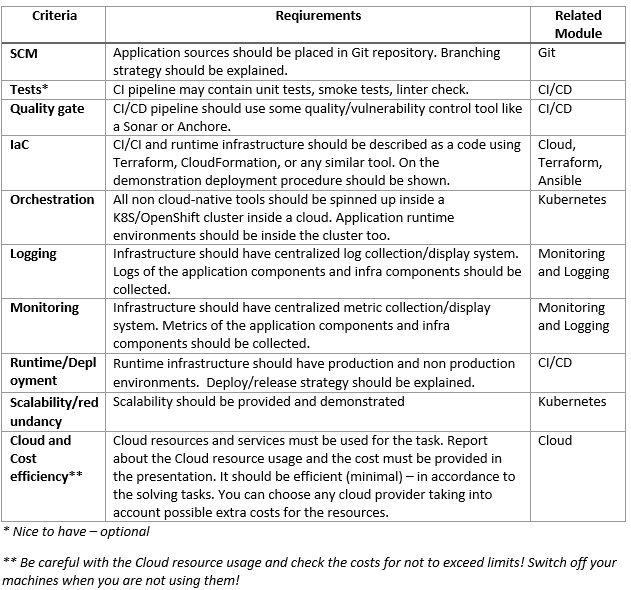

# **Diploma DevOps. NHL Application**

## **Task**
To attract hockey fans to marketing campaign you will need to find all games happened in Enterprise Center (St. Louis) during previous month (e.g. if now is March 05, 2021 last month means Feb 2021) and print a list of it with score and top 3 player by time on ice. Use https://gitlab.com/dword4/nhlapi API and store all the collected data in a local database.

## **Acceptance criteria**

### Application

Develop a simple (lightweight) 3-tire application (front-end, back-end, database).
Back-end (collects data) must:
1. Retrieve a portion of data from API (see in your Variant) and store it in a database
2. Update data on demand
3. Update DB schema if needed on app’s update

### Front-end (outputs data) must:
1. Display any portion of the data stored in the DB
2. Provide a method to trigger data update process

### Database:
1. Choose Database type and data scheme in a suitable manner. 
2. Data must be stored in a persistent way
3. It’s better to use cloud native DB solutions like an RDS/AzureSQL/CloudSQL.

## **URLs**

- http://ekolganov1.eastus.cloudapp.azure.com/main_nhl_app
- http://ekolganov1.eastus.cloudapp.azure.com/dev_nhl_app
- http://ekolganov1.eastus.cloudapp.azure.com/sonar
- http://ekolganov1.eastus.cloudapp.azure.com/jenkins/
- http://ekolganov1.eastus.cloudapp.azure.com/grafana/
- http://ekolganov1.eastus.cloudapp.azure.com/kib/
- https://hub.docker.com/repository/docker/karamel32/nhl_app_be
- https://hub.docker.com/repository/docker/karamel32/nhl_app

### Presentation
in repo EKolganov_diploma.pptx

### Scheme k8s
https://app.cloudskew.com/viewer/573afb6b-f0f4-44a8-baa0-9608f479302b
